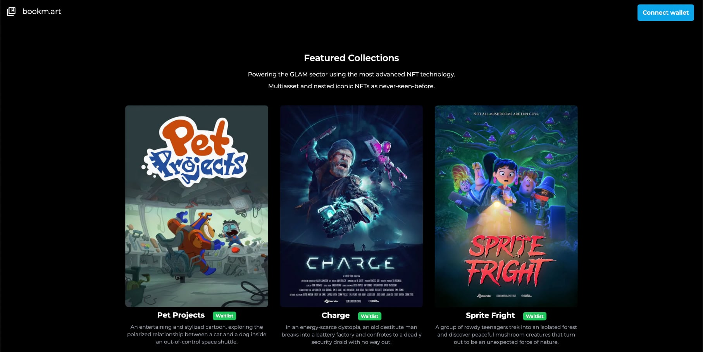

# BOOKM.ART

## Introduction

The most beautiful, powerful and intriguing objects have one thing in common: they live in galleries, libraries, archives, and museums (GLAM). All of them are institutions that collect and maintain cultural heritage materials in the public interest.

bookm.art is an open source platform powering the GLAM sector with richer digital experiences for their visitors on site and online using the NFT technology from RMRK built on zkSync Era.

RMRK - Buidlbox & zkSync Era Hack 0 Winner 🏆

bookm.art explores an innovative way of sharing stories and collections of content using the multi-asset and nested NFT smart contract implementations by the RMRK Team. From now the stories can be about a single object or a wider collection, but they always have a strong visual narrative binding assets such as images, audio, and video files.

Some of the benefits of nested and multi-assets NFTs for the GLAM sector are:

- Feature content collections, previews of exhibitions, or virtual tours.
- Promote perks and authenticity.
- Create a digital gift for someone you care about.
- Ensure more emotional, personal, and playful encounter with art.

## Tech stack

- RMRK legos smart contracts (Solidity)
- NextJS (React)
- Tailwind CSS
- Blocknative (Web3-onboard) for Metamask and Argent.
- Pinata (IPFS)

## Smart Contracts

Please check the repo with all the smart contracts and interactions [here](https://github.com/ivanmolto/era-smart-contracts-playground/tree/zksync)

Please note that the default branch is **zksync** not the master one
https://github.com/ivanmolto/era-smart-contracts-playground/tree/zksync

## User Journey

Visitors of a GLAM institution (galleries, libraries, archives and museums) can be whitelisted to get an NFT by sharing their public wallet address while acquiring their ticket for an exhibition or by dropping their ENS in a Twitter thread at https://twitter.com/bookm_art. Once the GLAM staff have minted an NFT to their address and start to add assets to their tokens the visitors can start accepting assets in the collection details page of https://www.bookm.art.

More details and script in the smart contracts repo [here](https://github.com/ivanmolto/era-smart-contracts-playground/blob/zksync/scripts/userJourney.ts)

## Frontend




This is a [Next.js](https://nextjs.org/) project bootstrapped with [`create-next-app`](https://github.com/vercel/next.js/tree/canary/packages/create-next-app).

First, run the development server:

```bash
npm run dev
# or
yarn dev
# or
pnpm dev
```

Open [http://localhost:3000](http://localhost:3000) with your browser to see the result.

## Deploy on Vercel

The easiest way to deploy your Next.js app is to use the [Vercel Platform](https://vercel.com/new?utm_medium=default-template&filter=next.js&utm_source=create-next-app&utm_campaign=create-next-app-readme) from the creators of Next.js.

Check out our [Next.js deployment documentation](https://nextjs.org/docs/deployment) for more details.

## License

The code is licensed under a MIT License.
Assets from Blender Studio are licensed under [CC-BY](https://creativecommons.org/licenses/by/4.0/) (license is also embedded in the metadata of each asset).
